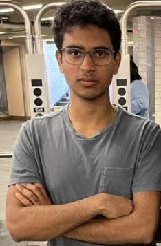

## [Hello!](https://jyopari.github.io/index)
 

 
I am Jyothish Pari, Jyo for short, an undergraduate student studying CS and Math at NYU. In my free time I like biking, learning math, catching (and releasing) insects, folding origami, and racing (virtually). Currently a research assistant working on the intersection of representation learning, reinforcement learning, and imitation learning at [CILVR NYU](https://wp.nyu.edu/cilvr/) advised by [Prof. Pinto](https://lerrelpinto.com). I am an incoming PhD Candidate at MIT with [Pulkit Agrawal](https://people.csail.mit.edu/pulkitag/). 

## [Google](https://scholar.google.com/citations?user=WyIW46YAAAAJ&hl=en) / [Semantic](https://www.semanticscholar.org/author/1518270974) Scholar. 

## Publications / Preprints 
+ Teach a Robot to FISH: Versatile Imitation from One Minute of Demonstrations \
 **Siddhant Haldar**, **Jyothish Pari**, Anant Rai, Lerrel Pinto \
   Preprint \
   [[Arxiv]](https://arxiv.org/abs/2303.01497) [[Website]](https://fast-imitation.github.io/) [[Code]](https://github.com/siddhanthaldar/FISH) 
+ The Surprising Effectiveness of Representation Learning for Visual Imitation \
  **Jyothish Pari***, Nur Muhammad (Mahi) Shafiullah*, Sridhar Pandian Arunachalam, Lerrel Pinto \
    RSS 2022\
    [[Arxiv]](https://arxiv.org/abs/2112.01511) [[Website]](https://jyopari.github.io/VINN/) [[Code]](https://github.com/jyopari/VINN/tree/main)
+ Playful Interactions for Representation Learning \
  Sarah Young, **Jyothish Pari**, Pieter Abbeel, Lerrel Pinto \
  IROS 2022\
  [[Arxiv]](https://arxiv.org/abs/2107.09046) [[Website]](https://sarahisyoung.github.io/play.html) 
+ Train Offline, Test Online: A Real Robot Learning Benchmark \
  G. Zhou*, V. Dean*, M. Srirama, A. Rajeswaran, **J. Pari**, K. Hatch, A. Jain, T. Yu, P. Abbeel, L. Pinto, C. Finn,
A. Gupta \
  ICRA 2023\
  Workshops: NeurIPS 2022 DeepRL, CoRL 2022 PRL (**Spotlight**), NeurIPS 2022 WBRC (**Best Paper Award**), NeurIPS 2022 Offline RL  \
  [[PDF]](https://openreview.net/pdf?id=VMspd1RnI_0) [[Website]](https://vdean.github.io/toto-benchmark.html) [[Code]](https://github.com/AGI-Labs/toto_benchmark/tree/release)
+ A Semi-Automated Computational Approach for Infrared Dark Cloud Localization \
  **Jyothish Pari**, Joseph L. Hora \
  *Publications of the Astronomical Society of the Pacific 132 (1011), 054301* 2020 \
  [[Arxiv]](https://arxiv.org/pdf/2003.01122.pdf) [[Code]](https://github.com/jyopari/IRDC)
+ Utilizing Priors to Guide Exploration\
**Jyothish Pari**, Denis Yarats, Lerrel Pinto\
[[PDF]](https://jyopari.github.io/guided_exploration/Guided_Exploration.pdf)
  
