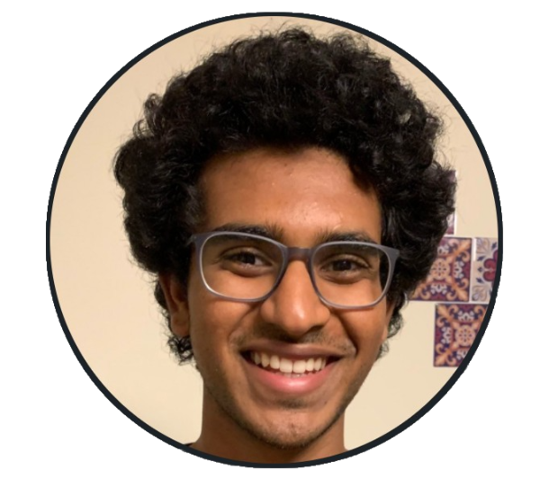

## Hello!
 
 
 
I am Jyothish Pari, Jyo for short, an undergraduate student studying CS and Math at NYU. In my free time I like playing with my two parakeets, catching (and releasing) insects, folding origami, and racing (virtually). Currently advised by [Dr. Pinto](https://lerrelpinto.com). 

## Publications 
+ Playful Interactions for Representation Learning \
  Sarah Young, **Jyothish Pari**, Pieter Abbeel, Lerrel Pinto \
  [Physical Reasoning Workshop](https://physical-reasoning.github.io/) Neurips (**ORAL**) \
  [[Arxiv]](https://arxiv.org/abs/2107.09046) [[Website]](https://sarahisyoung.github.io/play.html) 
+ A Semi-Automated Computational Approach for Infrared Dark Cloud Localization \
  **Jyothish Pari**, Joseph L. Hora \
  *Publications of the Astronomical Society of the Pacific 132 (1011), 054301* \
  [[Arxiv]](https://arxiv.org/pdf/2003.01122.pdf) [[Code]](https://github.com/jyopari/IRDC)
  
  
