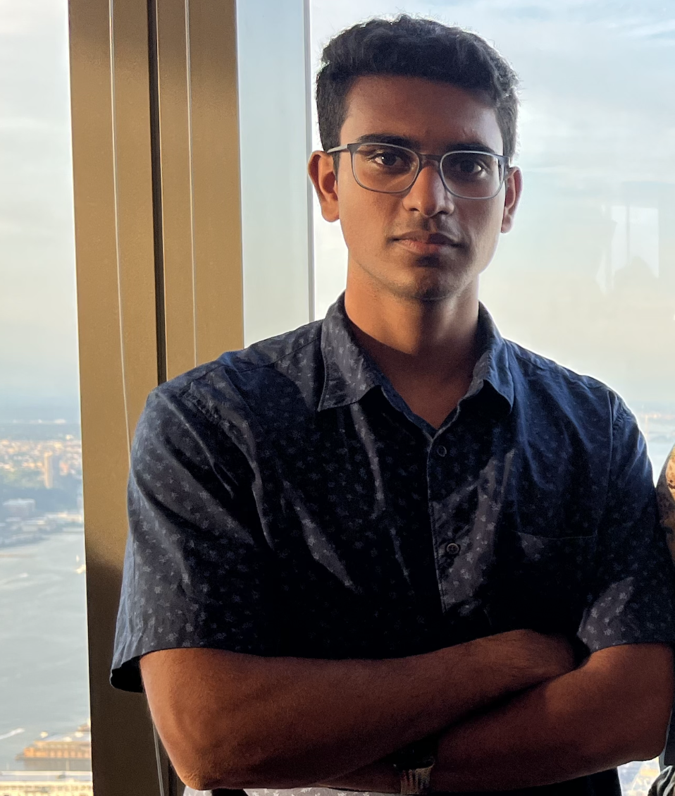

## Hello!
 
 
 
I am Jyothish Pari, Jyo for short, an undergraduate student studying CS and Math at NYU. In my free time I like playing with my two parakeets, catching (and releasing) insects, folding origami, and racing (virtually). Currently a research assistant working on reinforcement learning at [CILVR NYU](https://wp.nyu.edu/cilvr/) advised by [Prof. Pinto](https://lerrelpinto.com) and [Denis Yarats](https://cs.nyu.edu/~dy1042/). 

## Publications [Google](https://scholar.google.com/citations?user=WyIW46YAAAAJ&hl=en) / [Semantic](https://www.semanticscholar.org/author/1518270974) Scholar
+ The Surprising Effectiveness of Representation Learning for Visual Imitation \
  **Jyothish Pari***, Nur Muhammad (Mahi) Shafiullah*, Sridhar Pandian Arunachalam, Lerrel Pinto \
    RLDM 2022 \
    [[Arxiv]](https://arxiv.org/abs/2112.01511) [[Website]](https://jyopari.github.io/VINN/) [[Code]](https://github.com/jyopari/VINN/tree/main)
+ Playful Interactions for Representation Learning \
  Sarah Young, **Jyothish Pari**, Pieter Abbeel, Lerrel Pinto \
  Neurips [Physical Reasoning Workshop](https://physical-reasoning.github.io/) (**ORAL**) 2021\
  [[Arxiv]](https://arxiv.org/abs/2107.09046) [[Website]](https://sarahisyoung.github.io/play.html) 
+ A Semi-Automated Computational Approach for Infrared Dark Cloud Localization \
  **Jyothish Pari**, Joseph L. Hora \
  *Publications of the Astronomical Society of the Pacific 132 (1011), 054301* 2020 \
  [[Arxiv]](https://arxiv.org/pdf/2003.01122.pdf) [[Code]](https://github.com/jyopari/IRDC)
  
  
