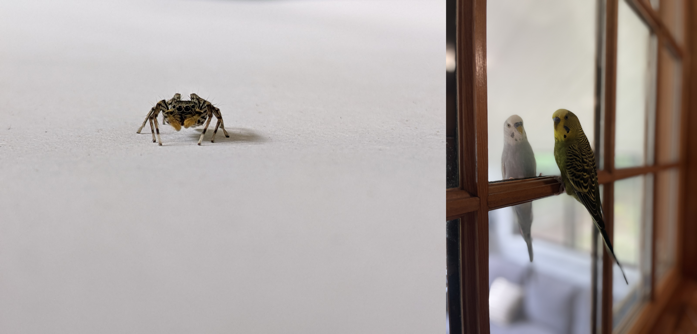

## Hello, I'm Jyo! 
### [about me](https://jyopari.github.io/aboutMe)
 \
(Left) A photograph I took of a motionless jumping spider, they are very [intelligent](https://www.nationalgeographic.com/news/2016/01/160121-jumping-spiders-animals-science/) creatures. (Right) My two parakeets. 

## Machine Learning
+ [Transformer](https://jyopari.github.io/Transformer)
+ [Variational Autoencoders w Implementation](https://jyopari.github.io/VAE)
+ [UMAP: Uniform Manifold Approximation and Projection for Dimension Reduction](https://jyopari.github.io/umap)

## Statistics
+ Markov chain Monte Carlo (MCMC)
  - [Gibbs Sampling](https://jyopari.github.io/Gibbs)
  - [Metropolis Hastings  w Implementation](https://jyopari.github.io/MetropolisHastings)
+ [Gaussian Process w Implementation](https://jyopari.github.io/GaussianProcess)
+ [KL Divergence](https://jyopari.github.io/KL)
+ [D Seperation In A Bayesian Network](https://jyopari.github.io/DSeperation)
+ [Generate Uniform Points In A Circle](https://jyopari.github.io/randomCirc)
+ [Exponential distribution](https://jyopari.github.io/exponentialDist)
+ [Gamma distribution](https://jyopari.github.io/Gamma)
+ [Reservoir Sampling](https://jyopari.github.io/reservoir)
+ [Intro to Optimal Transport TODO ]()
+ [Langevin Dynamics TODO]()

## Reinforcement Learning
+ [QLearning w Implementation](https://jyopari.github.io/QLearning) 
+ [Policy Gradients](https://jyopari.github.io/Policy)
+ [Monte Carlo Tree Search w Implementation](https://jyopari.github.io/MCTS)

## Math
+ [Johnson–Lindenstrauss lemma TODO]()
+ [Lagrange Multiplier](https://jyopari.github.io/Lagrange)
+ [Why Is The Gradient The Steepest Direction? (using Lagrange Multiplier)](https://jyopari.github.io/Gradient)
+ [Napoleon's Theorem](https://jyopari.github.io/NapoleonTriangle)

## Misc
+ [Locality Sensitive Hashing w Implementation](https://jyopari.github.io/LSH)
